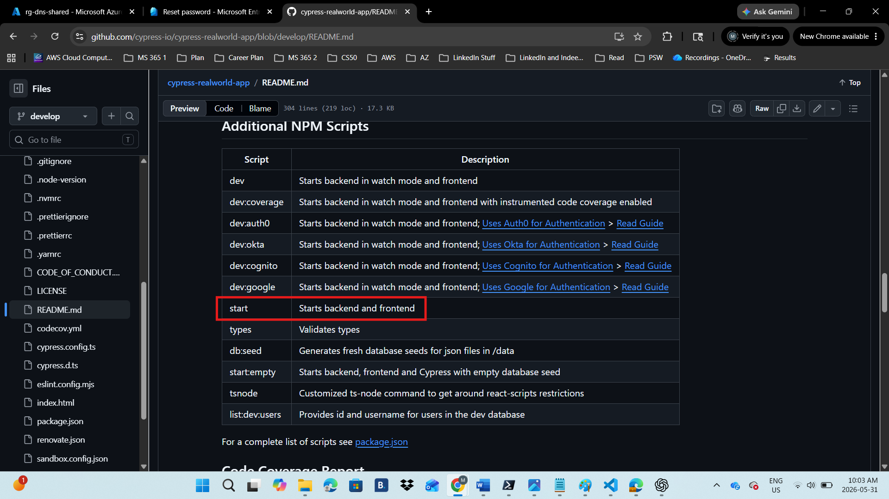
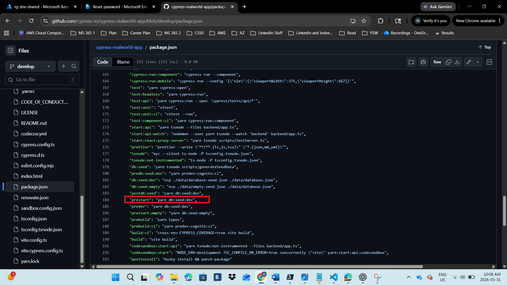

# Deployment Steps

All steps below were performed through the Azure Portal and GitHub unless stated otherwise. No Terraform used.

---

## Phase 1: Create the Resource Group

One resource group holds everything. No separate resource groups needed.

**Step 1:** Created the Resource Group
- Resource group name: rg-payflow
- Region: Canada Central — NexPay is Toronto-based

---

## Phase 2: Create the Key Vault

**Step 1:** Created the Key vault

- Resource group: rg-payflow
- Key vault name: kv-payflow
- Region: Canada Central
- Pricing tier: Standard
- Permission model: Azure role-based access control (RBAC)

**Step 2:** Granted myself the Key Vault Officer Role


**Step 3:** Added three secrets in the Key Vault.

- **SESSION-SECRET-STAGING**
- **SESSION-SECRET-PRODUCTION**
- **PAGINATION-PAGE-SIZE**

The session secret in `backend/app.ts` is hardcoded as the string `session secret` and must be replaced with a Key Vault reference.


---

## Phase 3: Create the App Service Plan and Web App

**Step 1:** Created App Service Plan and the Web App

- Resource group: rg-payflow
- Name: `payflow-production`
- Publish: Code
- Runtime stack: Node 20 LTS. The `package.json` engines field confirms `^20.0.0 || ^22.0.0` are both supported. Node 20 LTS is the current stable supported version in the portal
- Operating System: Linux
- Region: Canada Central
- Linux Plan: Created new — name `plan-payflow`, pricing plan Premium V3 P0v3. Chose it becuse it is the entry-level Premium tier and the minimum required to support deployment slots. Standard is legacy
- Continuous deployment: Disabled because GitHub Actions is configured manually in Phase 7
- Basic authentication: Enabled. Required to download the Publish Profile later

**Step 2:** Configured the startup command under Settings

```
yarn start
```

The README lists `start` as the script that starts the backend and frontend together. The `prestart` script runs automatically before it, copying `database-seed.json` to `database.json` to seed the database. One command handles both seeding and starting.





**Step 6:** Added three environment variables under Settings → Environment variables → App settings:

- `NODE_ENV` = `production` — without this the backend exposes the `/testData` route which allows anyone to wipe the database
- `WEBSITE_WEBDEPLOY_USE_SCM` = `true` — required for Linux web apps before downloading the Publish Profile
- `FRONTEND_URL` = `https://payflow-production.azurewebsites.net` — the CORS fix reads this to set the allowed browser origin

> **Note:** `PORT` was not set as an app setting. Azure App Service on Linux automatically injects `PORT` into `process.env` at runtime — adding it manually conflicts with the platform. `VITE_BACKEND_PORT` was also not set here — it is a Vite build-time variable baked into the React bundle at compile time and must be set in GitHub Actions during the `yarn build` step, not in the Azure portal.

Clicked Apply, then Apply.

**Step 7:** Enabled System Assigned Managed Identity under Settings → Identity → System assigned → toggled Status to On → clicked Yes. Copied and saved the Object (principal) ID.


---

## Phase 4: Add the Staging Deployment Slot

**Step 8:** Inside `payflow-production`, went to Deployment → Deployment slots → + Add. Filled in:
- Name: `staging`
- Clone settings from: `payflow-production` — copies the General settings including startup command and Node runtime

Clicked Add and waited for the slot to be created. The staging slot URL is `payflow-production-staging.azurewebsites.net`.


**Step 9:** Configured the staging slot's own environment variables. The slot cloned the general settings but not the app settings. Inside the staging slot management page, went to Settings → Environment variables → App settings and added:

- `NODE_ENV` = `production` — keeps `/testData` route disabled in staging too
- `WEBSITE_WEBDEPLOY_USE_SCM` = `true`
- `FRONTEND_URL` = `https://payflow-production-staging.azurewebsites.net` — staging has its own URL, CORS must allow this specific URL

Clicked Apply, then Apply.

**Step 10:** Enabled System Assigned Managed Identity on the staging slot under Settings → Identity → System assigned → toggled On → clicked Yes. Copied and saved the staging slot's Object (principal) ID — it is different from production's. Each deployment slot has its own Managed Identity.


---

## Phase 5: Grant Key Vault Access to Both Identities

Both the production Web App and the staging slot need their own Key Vault Secrets User role assignment. They have different Managed Identity IDs so each needs its own role assignment separately.

**Step 11:** Granted the production Web App access to Key Vault. Navigated to `kv-payflow` → Access control (IAM) → + Add → Add role assignment:
- Role: Key Vault Secrets User
- Members: Managed identity → App Service → `payflow-production` (the main slot, not staging)

Clicked Select, then Review + assign twice.

**Step 12:** Granted the staging slot access to Key Vault. Same path, same role:
- Members: Managed identity → App Service → `payflow-production/staging`

The staging slot appears as `payflow-production/staging` in the Managed Identity picker.


**Step 13:** Connected the Key Vault secrets to the production Web App. Navigated back to `payflow-production` main Web App → Settings → Environment variables → App settings and added:

- `SESSION_SECRET` = `@Microsoft.KeyVault(VaultName=kv-payflow;SecretName=SESSION-SECRET-PRODUCTION)`
- `PAGINATION_PAGE_SIZE` = `@Microsoft.KeyVault(VaultName=kv-payflow;SecretName=PAGINATION-PAGE-SIZE)`

Clicked Apply, then Apply. Both settings showed Status: Resolved confirming the production Web App reads secrets from Key Vault via its Managed Identity.

**Step 14:** Connected the Key Vault secrets to the staging slot. Navigated to the staging slot → Settings → Environment variables → App settings and added:

- `SESSION_SECRET` = `@Microsoft.KeyVault(VaultName=kv-payflow;SecretName=SESSION-SECRET-STAGING)` — also checked the **Deployment slot setting** checkbox. This marks `SESSION_SECRET` as slot-specific so it does not get swapped to production during a swap. Each environment keeps its own session secret permanently
- `PAGINATION_PAGE_SIZE` = `@Microsoft.KeyVault(VaultName=kv-payflow;SecretName=PAGINATION-PAGE-SIZE)`

Clicked Apply, then Apply. Both Key Vault references showed Status: Resolved.


---

## Phase 6: Code Fixes in the Fork

Three issues in the source code prevent it from working in production. These changes were made in the fork only — never in the original cypress-io repository. The README confirms the app runs on port 3000 (frontend) and 3001 (API backend) by default — none of the port configuration changes.

**Step 15:** Fixed the CORS configuration in `backend/app.ts`. The `corsOption` block had the origin hardcoded to `localhost` — any request from the Azure URL was blocked. Changed it to:

```typescript
const corsOption = {
  origin: process.env.FRONTEND_URL || `http://localhost:${frontendPort}`,
  credentials: true,
};
```

`FRONTEND_URL` is set differently per slot — production reads its URL, staging reads its URL. The fallback keeps local development working on port 3000 exactly as the README specifies.

**Step 16:** Fixed the session secret in `backend/app.ts`. Line 56 had `secret: "session secret"` hardcoded — this must come from Key Vault. Changed it to:

```typescript
secret: process.env.SESSION_SECRET || "session secret"
```

On Azure, `SESSION_SECRET` is resolved from Key Vault via the slot-specific setting. Locally it falls back to the hardcoded value which is fine for development as the README indicates.

**Step 17:** Fixed static file serving in `backend/app.ts`. Line 122 only served from `public/` but Vite's `yarn build` output goes to `build/`. Added the build folder immediately after the existing static line, then added the SPA fallback before the `getBackendPort().then` block:

```typescript
app.use(express.static(join(__dirname, '../public')));
app.use(express.static(join(__dirname, '../build')));

const apiPaths = ['/graphql','/users','/contacts','/bankAccounts',
  '/transactions','/likes','/comments','/notifications',
  '/bankTransfers','/testData'];

app.get('*', (req, res) => {
  const isApiRoute = apiPaths.some(p => req.path.startsWith(p));
  if (!isApiRoute) {
    res.sendFile(join(__dirname, '../build/index.html'));
  }
});
```

**Step 18:** Committed and pushed all three fixes:

```bash
git add backend/app.ts
git commit -m "fix: CORS, session secret, and static file serving for Azure production"
git push origin develop
```

---

## Phase 7: GitHub Environments and Actions Pipeline

**Step 19:** Downloaded two Publish Profiles — one for each slot. They are separate credentials:
- Went to the staging slot Overview page → clicked Download publish profile → saved as `staging-slot-publish-profile.xml`
- Went to the main `payflow-production` Overview page → clicked Download publish profile → saved as `production-slot-publish-profile.xml`

These files contain credentials and were not committed to the repository. Their contents were pasted directly into GitHub Secrets.

**Step 20:** Created two GitHub Environments under the repository Settings → Environments:

- **staging** — no protection rules, deploys automatically. Added secret `AZURE_WEBAPP_PUBLISH_PROFILE` with the full contents of `staging-slot-publish-profile.xml`
- **production** — checked Required reviewers under Deployment protection rules and added my GitHub username. This creates the manual approval gate. Added secret `AZURE_WEBAPP_PUBLISH_PROFILE` with the full contents of `production-slot-publish-profile.xml`


**Step 21:** Created `.github/workflows/deploy.yml` with the three-job pipeline and pushed it to `develop`. Also deleted all original Cypress workflow files from `.github/workflows/` — they were test-only pipelines that caused noise and failures on every push.

The three jobs:
- **Job 1 (ci):** Installs dependencies, runs type check, lint, unit tests, builds the frontend with `VITE_BACKEND_PORT=3001` baked in at build time, and uploads the full workspace as the `payflow-build` artifact
- **Job 2 (deploy-staging):** Downloads the artifact and deploys it to the staging slot automatically after CI passes
- **Job 3 (swap-to-production):** Downloads the same artifact, pauses for manual approval, then deploys to production

The same artifact from Job 1 is used by both Job 2 and Job 3 — staging and production always run the exact same compiled binary.


---

## Phase 8: Verify Everything Works

**Step 22:** Pushed to `develop` and went to the GitHub Actions tab. Watched the CI Quality Checks job pass through all steps — install, copy AWS exports, type check, lint, unit tests, build frontend. Deploy to Staging Slot ran automatically after CI. Swap to Production showed the orange Review deployments banner.

**Step 23:** Before approving, opened the staging URL `https://payflow-production-staging.azurewebsites.net` and confirmed the PayFlow login page loaded. Logged in with `Heath93` / `s3cret` and confirmed the dashboard loaded with transactions.


**Step 24:** Clicked Review deployments on the Swap to Production job, checked the box next to production, and clicked Approve and deploy. Watched the swap complete. Opened `https://payflow-production.azurewebsites.net` and confirmed both slots showed the PayFlow dashboard with transactions.


**Step 25:** Verified the full secrets chain on both slots:
- Went to `kv-payflow` → Secrets — clicked `SESSION-SECRET-PRODUCTION` and confirmed the value was hidden
- Went to `payflow-production` → Environment variables — `SESSION_SECRET` showed `@Microsoft.KeyVault(...)` with Status: Resolved
- Went to staging slot → Environment variables — `SESSION_SECRET` showed `@Microsoft.KeyVault(...)` referencing `SESSION-SECRET-STAGING` with Status: Resolved
- Checked GitHub Actions logs across completed runs — no secret values appeared anywhere in the output

---

## Problems Faced and Solutions

### Problems

- **`ncp: not found` on first deployment:** The `prestart` script called `ncp` to copy mock AWS export files. Azure's Oryx build engine (introduced July 2025) compresses `node_modules` into a `tar.gz` at deployment. The startup script ran before the extraction completed — `ncp` was inside the zip and inaccessible.

**Solution:** Created `scripts/fix-prestart.js` — a script that runs in GitHub Actions Job 1 before the artifact is uploaded, replacing `ncp` with Node.js's built-in `fs.copyFileSync` which requires nothing from `node_modules`. Added the file to `.prettierignore` to prevent Prettier from breaking the string escaping during CI.

---

- **`ts-node: No such file or directory` — broken symlink:** After fixing `ncp`, the start script called `ts-node` through `node_modules/.bin/ts-node`. That `.bin` entry is a shell script symlink. When GitHub Actions zips the artifact and Kudu extracts it, symlinks break. Updated `fix-prestart.js` to also rewrite the `start` script, calling `ts-node`'s real JavaScript entrypoint directly: `node node_modules/ts-node/dist/bin.js -P tsconfig.tsnode.json backend/app.ts`

**Solution:** Bypassed the broken symlink entirely by calling `node_modules/ts-node/dist/bin.js` directly — the real file, not the pointer.

---

- **`Still waiting...` infinite loop deadlock:** An early `startup.sh` had a `while` loop checking every 2 seconds until `ts-node` appeared in `node_modules/.bin`. Since the symlink was always broken, the loop ran forever. The container was alive enough to log but not healthy enough to accept new deployments or SSH connections.

**Solution:** Cleared the startup command directly in the Azure Portal to break the deadlock. The startup command field is the manual override when automation traps itself.

---

- **`cross-env: not found` and `nyc: not found`:** After fixing `ts-node`, the start script still called `cross-env` and `nyc` — both tools in `node_modules/.bin` with the same broken symlink problem.

**Solution:** Updated `fix-prestart.js` to strip both from the start script entirely.

---

- **`Cannot find module 'tsconfig-paths/register'`:** The `-r tsconfig-paths/register` flag told ts-node to preload `tsconfig-paths` before running. Same extraction issue.

**Solution:** Removed the flag entirely — the backend code does not use TypeScript path aliases so removing it had no functional impact.

---

- **`PORT undefined` — backend starting on a random port:** The backend's `getBackendPort()` function reads `VITE_BACKEND_PORT`, not `process.env.PORT`. `VITE_BACKEND_PORT` is a Vite build-time variable that does not exist as a runtime environment variable in the backend process. The function returned `undefined` and the app fell back to a random port. Azure's health check got no response.

**Solution:** Added `PORT=8080` and `VITE_BACKEND_PORT=8080` as App Service environment variables on both slots during troubleshooting.

---

- **`localhost:3001` hardcoded in 36 places across 9 machine files:** The React frontend compiled with `VITE_BACKEND_PORT=3001` baked permanently into the JavaScript bundle. Every API call went to `http://localhost:3001`. On Azure there is no localhost.

**Solution:** Added `apiBaseUrl` to `src/utils/portUtils.ts` returning `""` in production and `http://localhost:${backendPort}` in development. Ran `bash fix-backend-urls.sh` to replace all 36 instances automatically.

---

- **`import.meta.env.PROD` crashing the backend:** The URL fix used `import.meta.env.PROD` to detect production in `portUtils.ts`. Vite understands `import.meta` but Node.js does not. The backend imports `portUtils.ts` and crashed immediately.

**Solution:** Replaced with `process.env.NODE_ENV === "production"` which both runtimes understand.

---

- **Root route blocking React from loading:** The Express backend had `app.get("/", res.send("Cypress Realworld App - backend"))` defined above the static file middleware — intercepting every browser request before React could load.

**Solution:** Deleted those three lines entirely. Requests to `/` now fall through to `express.static("../build")` which serves `index.html`.

---

- **SPA fallback registered after the server started listening:** The `apiPaths` block and `app.get("*", ...)` wildcard were placed after the `getBackendPort().then(app.listen)` block. Routes must be registered before the server starts listening or they never fire.

**Solution:** Moved the entire SPA fallback block to before `getBackendPort().then`.