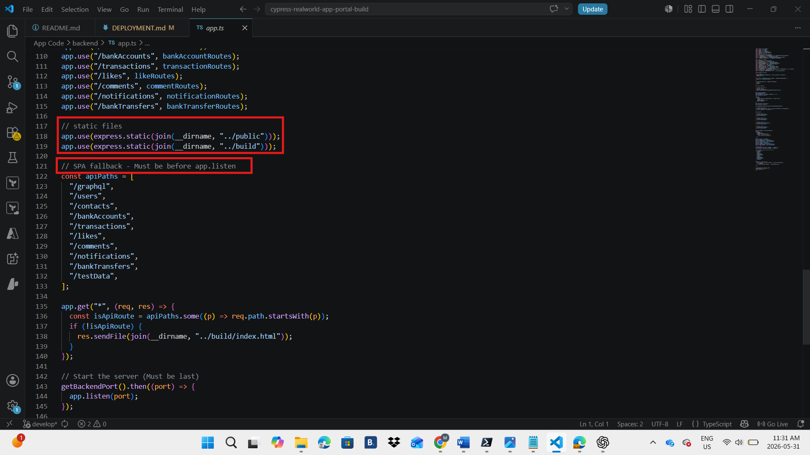

# Deployment Steps

All steps below were performed through the Azure Portal and GitHub unless stated otherwise. No Terraform used.
---

## Phase 0: Fork original Repo

Forked the original PayFlow repo on Github. `https://github.com/cypress-io/cypress-realworld-app`

---

## Phase 1: Create the Resource Group

One resource group holds everything. No separate resource groups needed.

**Step 1:** Created the Resource Group
- Resource group name: rg-payflow
- Region: Canada Central — NexPay is Toronto-based

---

## Phase 2: Create the Key Vault

**Step 1:** Created the Key vault

- Resource group: rg-payflow
- Key vault name: kv-payflow
- Region: Canada Central
- Pricing tier: Standard
- Permission model: Azure role-based access control (RBAC)

**Step 2:** Granted myself the Key Vault Officer Role


**Step 3:** Added three secrets in the Key Vault.

- **SESSION-SECRET-STAGING**
- **SESSION-SECRET-PRODUCTION**
- **PAGINATION-PAGE-SIZE**


The session secret in `backend/app.ts` is hardcoded as the string `session secret` and must be replaced with a Key Vault reference.


---

## Phase 3: Create the App Service Plan and Web App

**Step 1:** Created App Service Plan and the Web App

- Resource group: rg-payflow
- Name: `payflow-production`
- Publish: Code
- Runtime stack: Node 20 LTS. The `package.json` engines field confirms `^20.0.0 || ^22.0.0` are both supported. Node 20 LTS is the current stable supported version in the portal
- Operating System: Linux
- Region: Canada Central
- Linux Plan: Created new — name `plan-payflow`, pricing plan Premium V3 P0v3. Chose it becuse it is the entry-level Premium tier and the minimum required to support deployment slots. Standard is legacy
- Continuous deployment: Disabled because GitHub Actions is configured manually in Phase 7
- Basic authentication: Enabled. Required to download the Publish Profile later


**Step 2:** Configured the startup command under Settings

```
yarn start
```

The README lists `start` as the script that starts the backend and frontend together. The `prestart` script runs automatically before it, copying `database-seed.json` to `database.json` to seed the database. One command handles both seeding and starting.


**Step 3:** Added three environment variables

- `NODE_ENV` = `production`. Without this the backend exposes the `/testData` route which allows anyone to wipe the database
- `WEBSITE_WEBDEPLOY_USE_SCM` = `true`. Required for Linux web apps before downloading the Publish Profile
- `FRONTEND_URL` = `payflow-production-bjescndqgahyhuc5.canadacentral-01.azurewebsites.net`. For the CORS fix to set the allowed browser origin


**Step 7:** Enabled System Assigned Managed Identity on the Production Web App. Then copied and saved the production slot's Object (principal) ID.

---

## Phase 4: Add the Staging Deployment Slot

**Step 1:** Created the Staging Deployment Slot

- Name: `staging`
- Clone settings from: `payflow-production`


**Step 2:** Configured the staging slot's own environment variables.

- `NODE_ENV` = `production`
- `WEBSITE_WEBDEPLOY_USE_SCM` = `true`
- `FRONTEND_URL` = `https://payflow-production-staging.azurewebsites.net`


**Step 3:** Enabled System Assigned Managed Identity on the staging slot. Then copied and saved the staging slot's Object (principal) ID.

---

## Phase 5: Grant Key Vault Access to Both Identities

**Step 1:** Granted the production Web App access to Key Vault. 

- Role: Key Vault Secrets User
- Members: `payflow-production` (The production slot)

**Step 2:** Granted the staging slot access to Key Vault.

- Same role
- Members: `payflow-production/staging`


**Step 3:** Connected the Key Vault secrets to the production Web App. Status must show resolved

- `SESSION_SECRET`
- `PAGINATION_PAGE_SIZE`


**Step 4:** Connected the Key Vault secrets to the staging slot.

- `SESSION_SECRET` = `@Microsoft.KeyVault(VaultName=kv-payflow;SecretName=SESSION-SECRET-STAGING)`. Checked **Deployment slot setting** checkbox. So that each environment keeps its own session secret permanently
- `PAGINATION_PAGE_SIZE` = `@Microsoft.KeyVault(VaultName=kv-payflow;SecretName=PAGINATION-PAGE-SIZE)`


---

## Phase 6: Code Fixes in the Fork

I noticed three issues in the source code preventing it from working in production. These changes were made in the fork only.

**Step 1:** Fixed the CORS configuration in `backend/app.ts`. The `corsOption` block had the origin hardcoded to `localhost`. So Any request from the Azure URL was blocked. The change is the in the red box above in the screenshot.


`FRONTEND_URL` is set differently per slot. Production reads its URL, staging reads its URL.

**Step 2:** Fixed the session secret in `backend/app.ts` which was hardcoded as `secret: "session secret"` to come from Key Vault. Change is in the red box below;


On Azure, `SESSION_SECRET` is resolved from Key Vault via the slot-specific setting.

**Step 3:** Fixed static file serving in `backend/app.ts`.

- Added the build folder immediately after the existing static line 120.
- Added the SPA fallback(a bridge between Express and React Router) before the `getBackendPort().then` block:



---

## Phase 7: GitHub Environments and Actions Pipeline

**Step 1:** Downloaded two Publish Profiles, one for each slot.


**Step 2:** Created two GitHub Environments

- **staging**z: no protection rules, deploys automatically. Added secret `AZURE_WEBAPP_PUBLISH_PROFILE` with the full contents of `staging-slot-publish-profile.xml`
- **production**: Added my GitHub username as a required reviewer. This creates the manual approval gate. Added secret `AZURE_WEBAPP_PUBLISH_PROFILE` with the full contents of `production-slot-publish-profile.xml`


**Step 3:** Created a deployment file with the three-job pipeline. Check `.github/workflows/deploy.yml`
Also I deleted all original Cypress workflow files from `.github/workflows/`. They were test-only pipelines that caused noise and failures on every push.


The three jobs:
- **Job 1 (ci):** Installs dependencies, runs type check, lint, unit tests, builds the frontend with `VITE_BACKEND_PORT=3001` baked in at build time, and uploads the full workspace as the `payflow-build` artifact
- **Job 2 (deploy-staging):** Downloads the artifact and deploys it to the staging slot automatically after CI passes
- **Job 3 (swap-to-production):** Downloads the same artifact, pauses for manual approval, then deploys to production

The same artifact from Job 1 is used by both Job 2 and Job 3.

---

## Phase 8: Verify Everything Works

**Step 1:** Pushed to `develop` and went to the GitHub Actions tab. Watched the CI Quality Checks job pass through all steps.Swap to Production showed the orange Review deployments banner.


**Step 2:** Before approving, opened the staging URL `https://payflow-production-staging.azurewebsites.net` and confirmed the PayFlow login page never loaded. Then I encountered my first error


---

## Problems Faced and Solutions

### Problems and Solutions

- **1. `ncp: not found` on first deployment:** The `prestart` script called `ncp` to copy mock AWS export files. Azure's Oryx build engine compresses `node_modules` into a `tar.gz` at deployment and extracts it at container startup. By the time the startup script ran, `ncp` was not accessible. Either it was excluded from the archive or not yet extracted.


**Solution:** Created `scripts/fix-prestart.js`, a script that runs in GitHub Actions Job 1 before the artifact is uploaded, replacing `ncp` with Node.js's built-in `fs.copyFileSync` which requires nothing from `node_modules`. 
Added the file to `.prettierignore` as well to prevent Prettierfrom breaking the string escaping during CI.


---

- **2. `cross-env: not found`:** After fixing `ncp`, the `prestart` script was replaced successfully but the `start` script still called `cross-env` to set `NODE_ENV=development` before starting the app. `cross-env` is a third-party package that lives in `node_modules/.bin`. The same symlink problem as `ncp`. Azure could not find it at startup.


**Solution:** Updated `fix-prestart.js` to rewrite the `start` script entirely, replacing the original command with a direct `ts-node` call to the backend, bypassing `cross-env`, `concurrently`, and the Vite development server entirely.


---

- **3. `ts-node: not found`:** After fixing `cross-env`, the start script called `ts-node` through `node_modules/.bin/ts-node`. That `.bin` entry is a shell script symlink. When GitHub Actions zips the artifact and Kudu extracts it, symlinks break.


**Solution:** Updated `fix-prestart.js` to call `ts-node` through its  real JavaScript file directly, bypassing the broken `.bin` symlink entirely. Then added `PORT=8080` as an App Service environment variables so the backend knew which port to listen on and `VITE_BACKEND_PORT=8080` as well so getBackendPort() reads to start Express. Azure's health check got a response, the app was marked healthy, and the backend loaded.


---

- **4. Root route blocking React from loading:** The Express backend had `app.get("/", res.send("Cypress Realworld App - backend"))` under backend/app.ts lines 98, 99, and 100 defined above the static file middleware, intercepting every browser request before React could load.


**Solution:** Deleted those three lines entirely. Requests to `/` now fall through to `express.static("../build")` which serves `index.html`.


---

- **5. `localhost:3001` hardcoded in 36 places across 9 machine files:** The React frontend compiled with `VITE_BACKEND_PORT=3001` baked permanently into the JavaScript bundle. Every API call went to `http://localhost:3001` and on Azure there is no localhost.


**Solution:** Manually editing 36 instances across 9 files was too risky. One missed instance or a typo would cause a silent bug in production. I created a bash script using sed, a command line tool that finds and replaces text in files, which did all 36 replacements across 9 files automatically, and the script added `apiBaseUrl` to `src/utils/portUtils.ts` returning `""` in production and `http://localhost:${backendPort}` in development. 


---

- **6. `import.meta.env.PROD` crashing the backend:** After running `bash fix-backend-urls.sh` and `yarn dev` the URL fix used `import.meta.env.PROD` to detect production in `portUtils.ts`. Vite understands `import.meta` but Node.js does not. The backend imports `portUtils.ts` and crashed immediately.


**Solution:** I replaced it with `process.env.NODE_ENV === "production"` which both runtimes understand.


---

- **7. Busy Ports:** After the previous fix, I encountered another minor error, where the server failed to start on a number of ports.


**Solution:** I checked all the ports that were rejected and what was running on them and shutdown all the services and then `yarn dev` succeeded.


---

**Step 3, Wrong time:** Clicked Review deployments on the Swap to Production job, checked the box next to production, and clicked Approve and deploy. Watched the swap complete.

---

- **8. 401 Unauthorized Error:** After inputting the right credentials, saw this error after using `ctrl + f12`


**Solution:** 


---

**Step 4:** Verified the full secrets chain on both slots:
- Clicked `SESSION-SECRET-PRODUCTION` and confirmed the value was hidden
- Checked `SESSION_SECRET` and it showed `@Microsoft.KeyVault(...)` with Status: Resolved
- Went to staging slot and checked `SESSION_SECRET` which showed `@Microsoft.KeyVault(...)` referencing `SESSION-SECRET-STAGING` with Status: Resolved
- Checked GitHub Actions logs across completed runs and no secret values appeared anywhere in the output