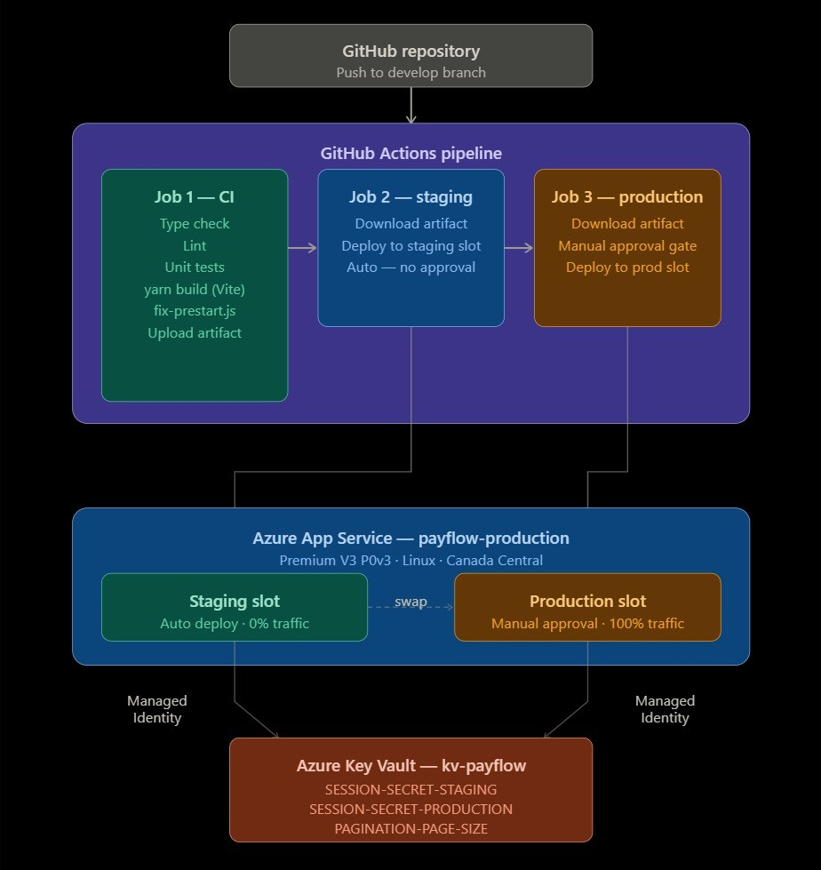

# A Full-Stack App Deployment on Azure - PayFlow

*A production-grade Node.js + React application deployed to Azure with a three-stage automated pipeline, secrets management, and zero-downtime slot swaps.*

---

## 1. Architecture

## 2. Tools Used

### Azure Services

- **Resource Group (rg-payflow):** Single resource group containing all PayFlow resources. App Service Plan, App Service, Key Vault, and Managed Identities.

- **Azure App Service Plan (Premium v3 P0v3):** The compute tier running the application. Basic B1 was considered and ruled out becuse Basic does not support deployment slots. Standard is legacy. Premium v3 P0v3 is the current non-legacy entry-level tier that supports deployment slots, giving us zero-downtime swaps and instant rollback capability.

- **Azure App Service - payflow-production:** The main App Service hosting both the frontend and backend. The Express backend serves the Vite-compiled React build as static files through the SPA fallback, meaning one App Service handles everything on one port.

- **Deployment Slot - staging:** A live mirror of the app running inside the same App Service. Staging deploys automatically on every push to `develop`. Production only receives code after a manual approval by the reuired reviewer. The slot swap is zero-downtime.

- **Azure Key Vault (kv-payflow):** One Key Vault containing three secrets shared across both slots, with slot-specific App Service settings controlling which secret each slot reads. `SESSION_SECRET` is marked as a deployment slot setting so it stays pinned to its slot during swaps and never crosses environments.

- **Managed Identity:** Each App Service slot has its own system-assigned Managed Identity in Microsoft Entra ID. Each identity is granted the Key Vault Secrets User role on the Key Vault, which allows the App Service to read secrets at runtime without any credentials stored anywhere.

### CI/CD

- **GitHub Actions:** Three-job pipeline triggered on every push to the `develop` branch. One artifact is built in Job 1 and reused by both Job 2 and Job 3. Staging and production ran the exact same compiled binary, built once using yarn build.

- **GitHub Environments (staging + production):** Each environment holds its own `AZURE_WEBAPP_PUBLISH_PROFILE` secret containing the XML credential file downloaded from Azure that authenticates GitHub Actions to deploy to that specific slot.

### Application

- **PayFlow (cypress-realworld-app):** A full-stack peer-to-peer payment demo app. React + TypeScript frontend compiled with Vite. Express.js backend running via ts-node. LowDB JSON file as the database. Probably built for local development only. Deploying it to Azure required solving a chain of infrastructure and code problems.

---

## 3. The Problem This Project Solves

### Why This Project Exists

The project brief was straightforward: Deploy PayFlow to Azure. No deployment configuration existed. No production environment had ever been considered.

What followed was not a straightforward deployment. The app had `localhost:3001` hardcoded in 36 places across 11 files. Its startup sequence depended on tools that Azure's runtime environment handles differently. The session secret was a hardcoded string. The backend served the wrong folder as static files. The root route intercepted every browser request before React could load.

Each fix revealed the next problem. The goal was to take this developer's local-only application and transform it into a professionally deployed cloud application, with a real CI/CD pipeline, proper secrets management, zero-downtime deployments, and environment separation between staging and production.

In the CI/CD pipeline, I implemented `cache: 'yarn'` in the setup-node step which caches Yarn's global download cache. On runs where dependencies have not changed, packages install from cache instead of the internet, saving approximately 2minutes per pipeline run.

### What This Deployment Delivers

- **Zero-downtime deployments:** Staging warms up before production ever receives traffic. The old production code stays in the staging slot ready to swap back instantly.
- **Secrets never in code:** SESSION_SECRET and PAGINATION_PAGE_SIZE live exclusively in Azure Key Vault. The App Service reads them through Managed Identity at runtime with no credentials stored anywhere.
- **Human approval before production:** The pipeline pauses after staging and waits for a reviewer to approve before anything touches production.
- **One build, two deployments:** The frontend is compiled exactly once. The same artifact deploys to staging and then to production. Both environments are guaranteed to run identical code.
- **Environment separation:** Each slot has its own session secret. `SESSION_SECRET` is marked as a deployment slot setting so it can never accidentally swap across environments.

---

## 4. Prerequisites

Before starting you need:

- **An active Azure subscription** with permission to create Resource Groups, App Service Plans, App Services, Key Vaults, and Managed Identities
- **A GitHub account** with a fork of the PayFlow repository and permission to create Environments and Secrets under Settings
- **Azure CLI installed** locally for verification and diagnostics
- **Node.js 22.x and Yarn Classic (v1) installed locally.** Run `npm install -g yarn` and confirm `yarn --version` shows `1.x.x`
- **Git Bash (on Windows),** required to run the bash fix scripts locally

---

## 5. Lessons Learned and Future Improvements

### Lessons Learned

- **Oryx is always running.** Azure App Service's build engine compresses `node_modules` into a `tar.gz` and extracts it at container startup. Any tool called through `node_modules/.bin` during startup relies on symlinks that Kudu's zip extraction breaks. The solution is to use Node.js built-in modules or call tool entrypoints directly by their JavaScript file path.

- **`Configured` and `Resolved` are not the same thing in Azure Key Vault references.** Configured means the reference syntax is saved. Resolved means the Managed Identity has permission to read the secret. Both must be true.

- **Vite bakes environment variables into the bundle at build time, not runtime.** Setting `VITE_BACKEND_PORT` in the Azure Portal after deployment does nothing. It must be set in the GitHub Actions build step before `yarn build` runs.

- **One build, two deployments.** Building the app twice, once for staging, once for production, is how subtle environment differences sneak into production undetected. The same artifact must deploy everywhere.

- **The manual approval gate is not just a safety feature.** It is the moment a human takes responsibility for what is about to touch production. Owning the code. Clicking approve without thinking defeats its entire purpose.

### Future Improvements

- **Terraform.** Provision all Azure resources as infrastructure as code so the entire environment can be recreated from scratch in minutes
- **Replace LowDB with Azure SQL or Cosmos DB.** The JSON file database cannot scale, persist properly across slot swaps, or survive concurrent writes
- **Azure Monitor alerts.** Alert on HTTP 5xx error rates and response time so production incidents are caught before users report them
- **Replace the `fix-prestart.js` workaround.** The proper long-term fix is to containerize the app with Docker so the Node.js version, Yarn version, and `node_modules` are all locked inside the image and Oryx never gets involved

---

© 2026 Mokenyu Kezongwe